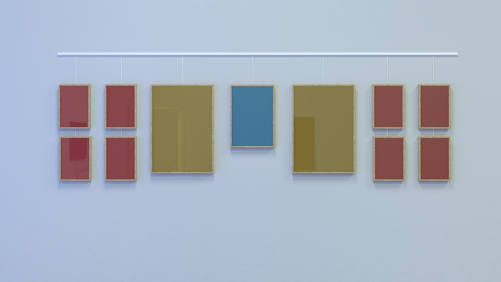

# Figus



**Dibujos con ploter conducido por código. Papel y Tinta.**

Colección de imágenes generadas mediante distintos algoritmos y materializadas con un plotter de corte y dibujo. A modo “álbum de figuritas” están organizadas según la curva de complejidad de sistemas de arte generativo propuesta en el paper “What is generative art?” (Galanter, 2003). Una recopilación de ejercicios que recorren la transición del orden al caos con algoritmos propios y reinterpretaciones de referentes como Sol Lewitt, Daniel Shiffman, Marius Watz y Golan Levin. A la selección que es montada sobre la pared la acompaña un álbum con 12 variaciones a escala para cada uno de estos “equipos”.

- Symmetry and Tiling: Sol Lewitt, Piet Mondrian, Islamic Art
- L-Systems and Fractals: Marius Watz
- Genetic Systems and A-Life: Golan Levin, Daniel Shiffman
- Chaotic Systems: Joy Division, Robert Hodgin, Golan Levin
- Randomization: Frieder Nake, Georg Nees

Generative math: Dealunay, Voronoi

---

Como cuando eramos chicos, al menos yo, 35 en el 2019.
La diferencia es que este álbum no se completa con los rostros de temporada.
Son retratos que sólo para [nosotros](#) significan algo.

---

### SVG

- [Optimizing Plots with a TSP Solver](https://nb.paulbutler.org/optimizing-plots-with-tsp-solver/) - Article
- [SVG Sort](https://github.com/inconvergent/svgsort) - Optimizar SVGs, CLI tool para otimizar los path. Por ahora el plotter no los reconoce...
- [Canvas2Svg.js](https://gliffy.github.io/canvas2svg/) - Turns your Canvas into SVG using javascript.

---

## Indice

- [Instrucciones](#instrucciones)
- [Flujo de trabajo](#flujo-de-trabajo)
- [Hardware](#hardware)
- [Código](#código)
  - [Drivers](#drivers)
  - [Librerías](#librerías)
  - [Desarrollo](#desarrollo)
  - [Ejemplos](#ejemplos)
  - [API](#api)
- [Enlaces útiles](#enlaces-útiles)

---

## Instrucciones

Como montar la obra

### Desarrollo

```
# Install the CLI tool globally
npm install canvas-sketch-cli -g

# Make a new folder to hold all your generative sketches
mkdir my-sketches

# Move into that folder
cd my-sketches

# Scaffold a new 'sketch.js' file and open the browser
canvas-sketch sketch.js --new --open
```

While in the browser, hit `Cmd + S` or `Ctrl + S` to export a high-resolution PNG of your artwork to your `~/Downloads` folder.

Some other commands to try:

```
# Start the tool on an existing file and change PNG export folder
canvas-sketch src/foobar.js --output=./tmp/

# Start a new sketch from the Three.js template
canvas-sketch --new --template=three --open

# Build your sketch to a sharable HTML + JS website
canvas-sketch src/foobar.js --build

# Develop with "Hot Reloading" instead of full page reload
canvas-sketch src/foobar.js --hot
```

For more features and details, see the [canvas-sketch Documentation](https://github.com/mattdesl/canvas-sketch/blob/master/docs/README.md).

1. En la carpeta `src` se encuentren los proyectos
2. Ingresar al proyecto y ejecutar `canvas-sketch sketch.js --open`

### Configuración

## API

Endpoints consumidos por el dispositivo:

| Endpoint            | Verb | Description                                        |
| ------------------- | ---- | -------------------------------------------------- |
| `/v1/recreo`        | GET  | If set to true, the result will also include cats. |
| `/v1/recreo/estado` | GET  | If set to true, the result will also include cats. |
| `/v1/recreo/estado` | PUT  | If set to true, the result will also include cats. |

**[Documentación API](https://colormono.com/recreo/api/reference/)**

## Flujo de trabajo


## Hardware

Lista de componentes utilizados

- NodeMCU 1.0 (ESP-12E Module)
- Modulo Display 4 digitos Catalex
- Modulo 1 Relay
- Modulo 1 Led RGB
- Timbre 220v
- Fuente de alimentación para protoboard 5v, 3.3v
- Fuente de alimentación 5v 2amp

## Código

Para poder compilar el código y subirlo al microcontrolador es requerido que estén instalados los drivers y las librerías listadas a continuación.

### Drivers

- [CP210x USB to UART Bridge VCP Drivers](https://www.silabs.com/products/development-tools/software/usb-to-uart-bridge-vcp-drivers) - Driver para dispositivos chinos
- [Driver CH340 MacOS](https://www.geekfactory.mx/download/driver-ch340-macos/) - Driver alternativo para dispositivos chinos

### Librerías

Las versiones de las librerías utilizadas al momento de desarrollo del proyecto se encuentran en el directorio `/libraries`.

- https://github.com/chrvadala/transformation-matrix
- https://www.npmjs.com/package/delaunay-triangulate
- http://leebyron.com/mesh/#hull.getregion

### 2D Libs

- [SVG.js](https://svgjs.com/docs/2.7/)
- [Vivus](https://maxwellito.github.io/vivus/)
- [TwoJS](https://two.js.org)
- [PaperJs](http://paperjs.org)
- [P5JS SVG](http://zenozeng.github.io/p5.js-svg)
- [roughjs](https://roughjs.com/)
- [Canvas2Svg](https://gliffy.github.io/canvas2svg/)

### Ejemplos

En el directorio `/examples` se encuentran sketchs con posibles soluciones a los ditstintos problemas, atacándolos por separado.

## Lecturas

- [Computational Stippling: Can Machines Do as Well as Humans?](https://blog.wolfram.com/2016/05/06/computational-stippling-can-machines-do-as-well-as-humans/) - May 6, 2016 — Silvia Hao,
- [StippleGen: Weighted Voronoi stippling and TSP paths in Processing](https://www.evilmadscientist.com/2012/stipplegen-weighted-voronoi-stippling-and-tsp-paths-in-processing/)
- [Stippling, or, a Voronoi Stippler](https://mrl.nyu.edu/~ajsecord/stipples.html)
- [Travelling Salesman Art](http://www.drububu.com/illustration/tsp/index.html)
- [On Generative Algorithms](https://inconvergent.net/generative/) - Essay was written between late 2015 and mid 2016 by Anders Hoff.
- [Linear Interpolation](https://mattdesl.svbtle.com/linear-interpolation)

## Enlaces útiles

- [Awesome generative art](https://github.com/kosmos/awesome-generative-art) - Manually curated collection of Generative Art resources, tools and shiny things.
- [Awesome creative coding](https://github.com/terkelg/awesome-creative-coding) - Creative Coding: Generative Art, Data visualization, Interaction Design, Resources.
- [canvas-sketch](https://github.com/mattdesl/canvas-sketch) - A framework for making generative artwork in JavaScript and the browser by Matt DesLauriers.
- [canvas-sketch Documentation](https://github.com/mattdesl/canvas-sketch/blob/master/docs/README.md)
- [canvas-sketch Cheat Sheet](https://github.com/mattdesl/workshop-generative-art/blob/master/docs/cheat-sheet.md)
- [Generative Art Workshop with Canvas-Sketch](https://github.com/mattdesl/workshop-generative-art)
- [canvas-sketch-util](https://github.com/mattdesl/canvas-sketch-util) - Utilities for generative art in Canvas, WebGL and JavaScript.
- [Math as code](https://github.com/Jam3/math-as-code) - Reference to ease developers into mathematical notation by showing comparisons with JavaScript code.
- [Tim holman](https://generativeartistry.com/) - Artist portfolio
- [Tyler Hobbs](https://tylerxhobbs.com/) - Artist portfolio
- [INCONVERGENT](https://inconvergent.net/#about) - Work and experiments by Anders Hoff.

### Penplotter

- [Awesome Plotters](https://github.com/beardicus/awesome-plotters) - A curated list of code and resources for computer-controlled drawing machines and other visual art robots.
- [Pen Plotter Art & Algorithms, Part 1](https://mattdesl.svbtle.com/pen-plotter-1) - Article by Matt DesLauriers
- [Pen Plotter Art & Algorithms, Part 2](https://mattdesl.svbtle.com/pen-plotter-2) - Article by Matt DesLauriers
- [2D Transformations](https://processing.org/tutorials/transform2d/) - Article by J David Eisenberg
- [Pen Plotter Programming: The Basics](https://medium.com/@fogleman/pen-plotter-programming-the-basics-ec0407ab5929) - Article by Michael Fogleman
- [An intro to Pen Plotters](http://www.tobiastoft.com/posts/an-intro-to-pen-plotters) - Article by Tobias Toft
- [Anders Hoff](http://inconvergent.net/) (Inconvergent) writes a lot about his process in Python and Lisp.
- [Michael Fogleman](https://medium.com/@fogleman/pen-plotter-programming-the-basics-ec0407ab5929) wrote a blog article on pen plotter basics. He’s also written tools like ln, a 3D to 2D line art engine for Go.
- [Tyler Hobbs](http://www.tylerlhobbs.com/writings) writes about generative art and programming, and his work shares many parallels with my process here.
- [Paul Butler](http://www.tobiastoft.com/posts/an-intro-to-pen-plotters) recently wrote a blog post on his pen plotter work in Python.
- [Stipplegen](https://github.com/evil-mad/stipplegen) - Software that can create stipple drawings and “TSP art,” from image files
- [Fonts](http://imajeenyus.com/computer/20150110_single_line_fonts/index.shtml) - Penplotter typography
- [Optimizing Plots with a TSP Solver](https://nb.paulbutler.org/optimizing-plots-with-tsp-solver/) - By Paul Butler – March 25, 2018
- [Drawing SVG path and polygon in cm](https://stackoverflow.com/questions/30806126/drawing-svg-path-and-polygon-in-cm/30806975)
- [Blackstripes drawings](https://github.com/fullscreennl/blackstripes-python-extensions) - turns an png image into a svg line drawing
- [P5 SVG](http://zenozeng.github.io/p5.js-svg/examples/#basic)
- [svg path sorter](https://github.com/inconvergent/svgsort) for more efficient (pen)plotting. https://inconvergent.net/
- [Turtle graphics](http://compform.net/turtles/)
- https://mathematica.stackexchange.com/questions/118992/how-can-mathematica-be-used-to-create-images-like-these/118995
- [triangle-divider](https://depasquale.art/works/triangle-divider/) by depasquale.art
- [Poisson Disk Sampling in Processing](https://sighack.com/post/poisson-disk-sampling-bridsons-algorithm)

### AR

### 3D and Shaders

- https://github.com/fogleman/ln
- https://threejs.org/docs/#examples/renderers/SVGRenderer
- https://www.marciot.com/blog-demos/three-to-svg/
- https://mt236.wordpress.com/2016/03/26/using-three-js-to-render-to-svg/

### Thermal Printer

- [Thermal Printer technical details](https://www.adafruit.com/product/597)
- [Thermal Printer manual](https://cdn-shop.adafruit.com/datasheets/CSN-A2+User+Manual.pdf)
- [Thermal Printer tutorial](https://learn.adafruit.com/mini-thermal-receipt-printer)
- [Printing bitmap hacking](https://learn.adafruit.com/mini-thermal-receipt-printer/hacking)
- [Tutorial PatagoniaTec](https://saber.patagoniatec.com/2014/09/mini-impresora-termina-uart-arduino-argentina-ptec-qr-codigo-barras/)
- [Tutorial para usar con la Raspberry](http://pikiosk.tumblr.com/post/38866317521/printing-with-raspberry)

TRABAJANDO CON:

MODELO: CP437 VERSION 2.69
BAUDRATE: 19200
DEGREE: 29
VOLTAGE: 7.5
HEAT DOT=80
ON=1300
OFF=100

Bitmap Printing
This printer can print out bitmaps, which can add a touch of class to a receipt with your logo or similar.
The first step is to get the logo prepared. The printer can only do monochrome (1-bit) images, and the maximum width is 384 pixels.

The Adafruit_Thermal library folder that you previously downloaded contains a sub-folder called processing. Inside that is a sketch called bitmapImageConvert.pde. Load this into Processing and press RUN (the triangle button).

You’ll be prompted to select an image using the system’s standard file selection dialog. The program runs for just a brief instant, and will create a new file alongside the original image file. For example, if you selected an image called “adalogo.png”, there will be a new file called “adalogo.h” in the same location. This file contains code to add to your Arduino sketch. You shouldn’t need to edit this file unless you want to change the variable names within.

To get this file into your Arduino sketch, select “Add File…” from the Sketch menu. This will add a new tab to your code. Your original code is still there under the leftmost tab.

Next, in the tab containing the main body of your code, add an “include” statement to reference the new file:
`#include "adalogo.h"`

Check the A_printertest example sketch if you’re not sure how to include the code properly.

If the source image was called adalogo.png, then the resulting .h file (adalogo.h) will contain three values called adalogo_width, adalogo_height and adalogo_data, which can be passed directly and in-order to the printBitmap() function, like this:
`printBitmap(adalogo_width, adalogo_height, adalogo_data);`
