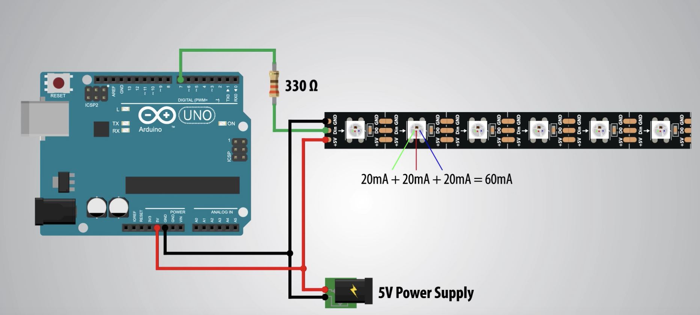

# Todo comienza con un punto **que enciende**

**Tira de Led, Madera, Acrílico esmerilado, Microcontrolador.**

Colección de imágenes generadas mediante distintos algoritmos y materializadas con un plotter de corte y dibujo. A modo “álbum de figuritas” están organizadas según la curva de complejidad de sistemas de arte generativo propuesta en el paper “What is generative art?” (Galanter, 2003). Una recopilación de ejercicios que recorren la transición del orden al caos con algoritmos propios y reinterpretaciones de referentes como Sol Lewitt, Daniel Shiffman, Marius Watz y Golan Levin. A la selección que es montada sobre la pared la acompaña un álbum con 12 variaciones a escala para cada uno de estos “equipos”.

---

## Instrucciones

Como montar la obra.

### Configuración

## API

Endpoints consumidos por el dispositivo:

| Endpoint            | Verb | Description                                        |
| ------------------- | ---- | -------------------------------------------------- |
| `/v1/recreo`        | GET  | If set to true, the result will also include cats. |
| `/v1/recreo/estado` | GET  | If set to true, the result will also include cats. |
| `/v1/recreo/estado` | PUT  | If set to true, the result will also include cats. |

**[Documentación API](https://colormono.com/recreo/api/reference/)**

## Flujo de trabajo

## Hardware

Estoy utilizando una tira de les WS2812B con 60 leds por metro que tiene la particularidad de permitir el control individual de los leds. Para desarrollar elegí la librería [FastLED](https://github.com/FastLED/FastLED) porque funciona con varios modelos de tiras de led, está bien documentada, permite usar el [modelo de color HSV](http://en.wikipedia.org/wiki/HSL_and_HSV) y cuenta con transiciones vía [operaciones matemáticas](https://github.com/FastLED/FastLED/wiki/High-performance-math).

Lista de componentes utilizados:

- Raspberry Pi / Arduino Uno
- Tira de LED WS2812B con 60 leds por metro
- Fuente de alimentación 5v 2amp

### Circuito

Circuito básico, "Hello leds"

## Código

Para poder compilar el código y subirlo al microcontrolador es requerido que estén instalados los drivers y las librerías listadas a continuación.

### Drivers

- [CP210x USB to UART Bridge VCP Drivers](https://www.silabs.com/products/development-tools/software/usb-to-uart-bridge-vcp-drivers) - Driver para dispositivos chinos
- [Driver CH340 MacOS](https://www.geekfactory.mx/download/driver-ch340-macos/) - Driver alternativo para dispositivos chinos

### Librerías

Las versiones de las librerías utilizadas al momento de desarrollo del proyecto se encuentran en el directorio `/libraries`.

- [FastLed](https://github.com/FastLED/FastLED) - (Arduino) Librería para controlar los Leds individualmente
- [Generative Design para Processing v3](https://github.com/generative-design/Code-Package-Processing-3.x) - (Processing) Librería que, entre otras utilidades, cuenta con funciones para ordernar pixeles.

### Ejemplos

En el directorio `/examples` se encuentran sketchs con posibles soluciones a los ditstintos problemas, atacándolos por separado.

## Lecturas

-

## Enlaces útiles

- [Comunicación entre Arduino y Processing](https://learn.sparkfun.com/tutorials/connecting-arduino-to-processing/all)
- [Tutorial para los leds](https://howtomechatronics.com/tutorials/arduino/how-to-control-ws2812b-individually-addressable-leds-using-arduino/)
- [Alimentar tira de led con fuente de PC](https://www.youtube.com/watch?v=srJgt85cUMY)
