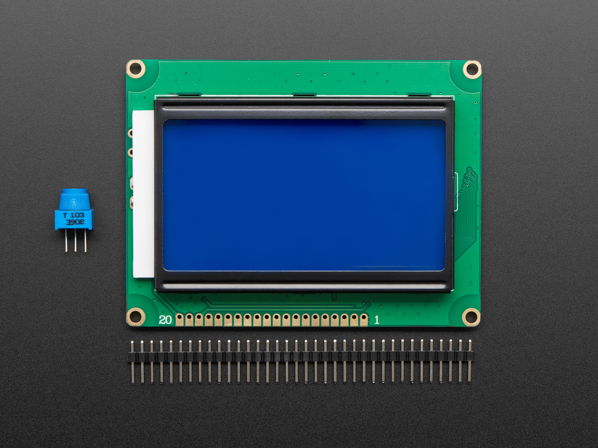
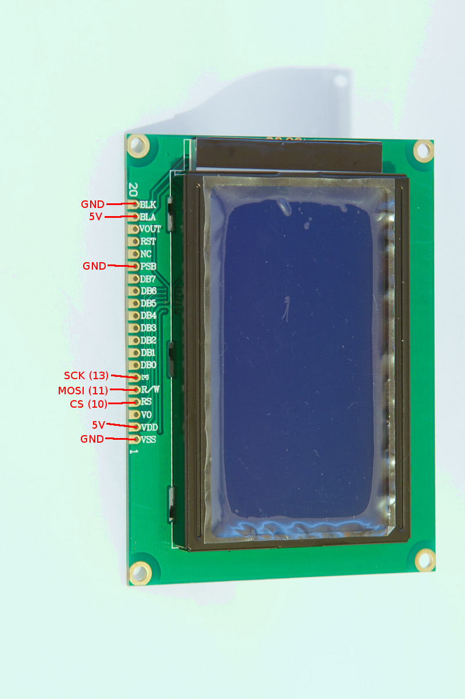

# Todo comienza con un punto que \_\_\_

**Pantalla de led enmarcada. Microcontrolador.**

Pantalla de led enmarcada. En el display se muestra un texto formado por dos partes. La primer parte fija "Todo comienza con un punto que" y la segunda parte variable "se expande", "crece", "se mueve", "se ilumina", etc. Estas frases varían entre recreo y recreo.

## Instrucciones

Como montar la obra.

- Colgar el cuadro a la pared
- Enchufarlo

## Flujo de trabajo

### Hardware

Lista de componentes utilizados

- Arduino Uno
- NodeMCU 1.0 (ESP-12E Module)
- Modulo Display LCD ()
- Fuente de alimentación para protoboard 5v, 3.3v
- Fuente de alimentación 5v 2amp

### Circuito

U8GLIB_ST7920_128X64_4X u8g(13, 11, 10);

**SPI Com:**

- SCK = 13 (E)
- MOSI = 11 (R/W)
- CS = 10 (RS)

### Drivers

Para poder subir el código al microcontrolador es requerido que estén instalados los drivers.

- [CP210x USB to UART Bridge VCP Drivers](https://www.silabs.com/products/development-tools/software/usb-to-uart-bridge-vcp-drivers) - Driver para dispositivos chinos
- [Driver CH340 MacOS](https://www.geekfactory.mx/download/driver-ch340-macos/) - Driver alternativo para dispositivos chinos

### Librerías

Las versiones de las librerías utilizadas al momento de desarrollo del proyecto se encuentran en el directorio `/libraries`.

- [u8glib](https://github.com/olikraus/u8glib/) - Arduino Monochrom Graphics Library for LCDs and OLEDs
- [u8g2](https://github.com/olikraus/u8glib/) - U8glib library for monochrome displays, version 2

### Código y ejemplos

El código fuente se encuentra en la carpeta `/src`. En el directorio `/examples` se encuentran sketchs con posibles soluciones a los ditstintos problemas, atacándolos por separado.

## API

Endpoints consumidos por el dispositivo:

| Endpoint            | Verb | Description                                        |
| ------------------- | ---- | -------------------------------------------------- |
| `/v1/recreo`        | GET  | If set to true, the result will also include cats. |
| `/v1/recreo/estado` | GET  | If set to true, the result will also include cats. |
| `/v1/recreo/estado` | PUT  | If set to true, the result will also include cats. |

**[Documentación API](https://colormono.com/recreo/api/reference/)**

## Enlaces útiles

- [Supported devices by u8glib](https://github.com/olikraus/u8glib/wiki/device)
- [128 x 64 Graphic LCD Datasheet](http://www.vishay.com/docs/37329/37329.pdf)
- [LCD128x64 using only 3 Arduino pins](https://www.youtube.com/watch?v=DQoQtSKa6Tc) - Video tutorial
- [Cheap 128×64 graphic lcd (12864zw)](http://www.bajdi.com/cheap-128x64-graphic-lcd-12864zw/)
